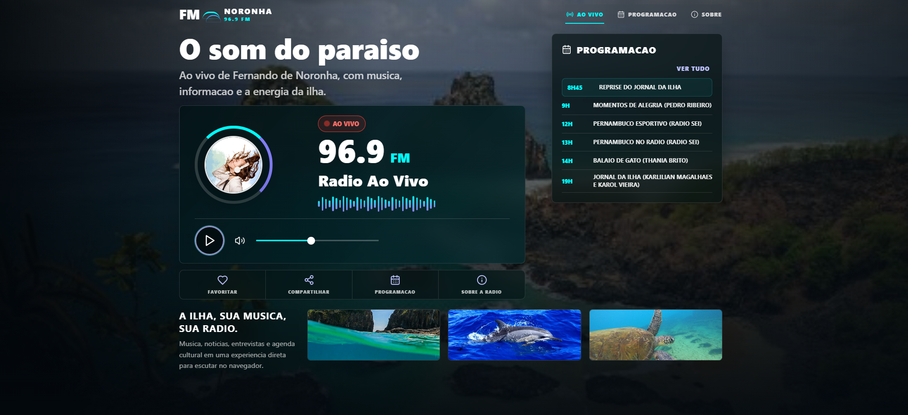

# FM Noronha Web

Versao web da FM Noronha 96.9, feita com React, Vite e TypeScript. O app e independente do projeto mobile Expo e pode ser publicado separadamente na Vercel.



## Visao Geral

- Player de radio ao vivo usando `HTMLAudioElement`.
- Stream padrao: `https://8136.brasilstream.com.br/stream`.
- Layout responsivo inspirado na identidade da FM Noronha.
- Programacao, modais de sobre/compartilhar/avaliar e estados de carregamento/erro.
- Deploy preparado para Vercel com `vercel.json`.

## Repositorios

| Projeto | Repositorio |
| ------- | ----------- |
| Web | [henriquelira2/fm-noronha-web](https://github.com/henriquelira2/fm-noronha-web) |
| Mobile | [henriquelira2/NEW_FM_NORONHA](https://github.com/henriquelira2/NEW_FM_NORONHA) |

## Tecnologias

- React 19
- Vite 6
- TypeScript
- lucide-react
- CSS global sem framework externo

## Requisitos

- Node.js 20 ou superior recomendado
- npm

## Como Rodar Localmente

```bash
npm install
npm run dev
```

O Vite normalmente abre em:

```bash
http://localhost:5173
```

## Scripts

```bash
npm run dev
```

Inicia o ambiente de desenvolvimento.

```bash
npm run build
```

Valida TypeScript e gera o bundle de producao em `dist/`.

```bash
npm run preview
```

Serve localmente o build gerado.

```bash
npm run preview:host
```

Serve o build expondo o host `0.0.0.0`, util para testes em rede local ou ambientes de preview.

## Variaveis de Ambiente

Copie o arquivo de exemplo quando quiser sobrescrever o stream:

```bash
cp .env.example .env.local
```

Variavel disponivel:

```bash
VITE_RADIO_STREAM_URL=https://8136.brasilstream.com.br/stream
```

Se a variavel nao for definida, o app usa o stream padrao acima.

## Estrutura

```text
web/
  public/
    fm-noronha-web.png
  src/
    assets/
    components/
    data/
    hooks/
    App.tsx
    main.tsx
    styles.css
  vercel.json
```

## Deploy na Vercel

Configuracao recomendada:

- Framework Preset: `Vite`
- Install Command: `npm install`
- Build Command: `npm run build`
- Output Directory: `dist`

O arquivo `vercel.json` ja define essas opcoes e inclui rewrite para SPA.

Mais detalhes em [docs/DEPLOY.md](./docs/DEPLOY.md).

## Qualidade

Antes de publicar:

```bash
npm run build
```

Tambem teste no navegador:

- Play/pause do stream.
- Estados de carregamento e erro.
- Modal de programacao.
- Modal de compartilhar.
- Responsividade em desktop e mobile.

## Links Uteis

- [Repositorio web](https://github.com/henriquelira2/fm-noronha-web)
- [Repositorio mobile](https://github.com/henriquelira2/NEW_FM_NORONHA)
- [Deploy na Vercel](./docs/DEPLOY.md)
